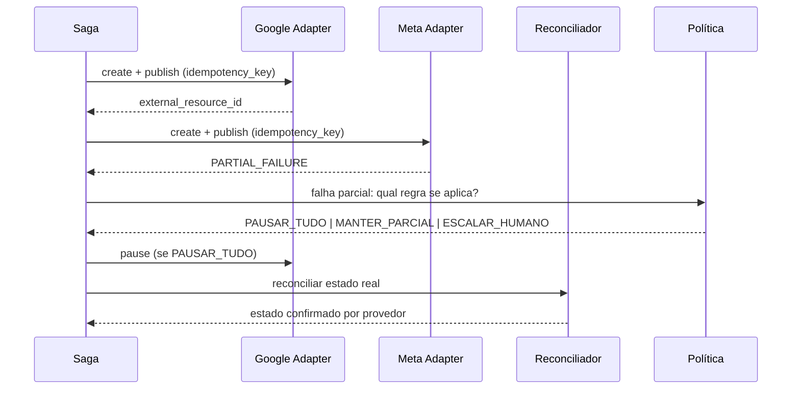

# CAMPAIA — CONTRATO DO ADS CONNECTOR HUB E CATÁLOGO DE EVENTOS

**Versão:** 1.0.0 (PROPOSTA) · **Data:** 25/08/2026 · **Nota de status corrigida em:** 28/08/2026 (P-15)

---

## 1. Interface canônica do conector

Todo adaptador (Google Ads, Meta, WhatsApp) **deve** implementar exatamente esta interface — este é o
contrato-alvo da integração, não uma afirmação de que a implementação já existe para as três plataformas.
Diferenças reais entre plataformas aparecem no **Capability Registry**, nunca em métodos exclusivos vazando
para o domínio. **Ver "Status real de implementação" logo após a tabela.**

| Método | Efeito externo | Exige `policy_decision_id` | Idempotente |
|---|---|---|---|
| `connect_account(tenant_id, provider, oauth_grant)` | Sim | Sim | Sim (por grant) |
| `list_accounts(tenant_id, provider)` | Não | Não | — |
| `describe_capabilities(external_account_id)` | Não | Não | — |
| `validate_draft(plan, external_account_id)` | **Não** | Não | — |
| `create_campaign(command)` | Sim | **Sim** | **Sim** |
| `create_ad_set(command)` | Sim | **Sim** | **Sim** |
| `upload_asset(command)` | Sim | Sim | Sim |
| `create_ad(command)` | Sim | **Sim** | **Sim** |
| `publish(command)` | Sim | **Sim** | **Sim** |
| `pause(command)` / `resume(command)` | Sim | **Sim** | **Sim** |
| `update_budget(command)` | Sim | **Sim** | **Sim** |
| `fetch_insights(query)` | Não | Não | — |
| `sync_conversions(command)` | Sim | Sim | Sim |
| `handle_webhook(raw_event)` | Não | Não | **Sim** (dedupe por id externo) |

> **Status real de implementação (corrigido em 28/08/2026 — P-15).** Este documento é uma PROPOSTA de
> interface-alvo (ver cabeçalho). A frase de abertura desta seção, no entanto, estava redigida no presente
> ("implementa exatamente esta interface"), o que lia como se a implementação já existisse para as três
> plataformas. Verificação direta contra o código em `backend/campaia_core/connectors.py` e
> `backend/campaia_core/simulator.py`, feita em 28/08/2026, confirma que isso não é o caso:
>
> - **Nenhum adaptador real de Google Ads, Meta ou WhatsApp existe no código.** O único componente que
>   implementa este contrato é o `ProviderSimulator` (`simulator.py`), destinado a desenvolvimento e testes
>   (ADR-0013, item 4) — não uma integração real com qualquer plataforma.
> - Da lista de 14 métodos acima, **apenas 3 têm implementação real**, tanto no protocolo `AdsConnector`
>   (`connectors.py`) quanto no `ProviderSimulator`: `validate_draft`, `publish` e `pause`.
> - Os outros 11 métodos — `connect_account`, `list_accounts`, `describe_capabilities`, `create_campaign`,
>   `create_ad_set`, `upload_asset`, `create_ad`, `resume`, `update_budget`, `fetch_insights`,
>   `sync_conversions`, `handle_webhook` — **não existem em nenhum arquivo do backend** atual.
>
> Correção autorizada pelo Diretor em 28/08/2026. Detalhe completo, com citação literal do código antes e
> depois desta correção, em `docs/evidence/EVIDENCIA_P15_20260828.md`.

### 1.1 Regras invariantes

1. **Nenhum método aceita credencial como argumento.** O adaptador resolve a credencial pelo
   `external_account_id` contra o cofre. Chamador nunca vê token.
2. **Toda mutação carrega `idempotency_key`** derivada de `(tenant_id, command_id)`. Repetir o comando não
   duplica efeito.
3. **`validate_draft` nunca toca a plataforma de forma mutável.** É o ensaio antes da Saga.
4. **Estado externo é sempre lido da plataforma**, nunca inferido da intenção. `ACTIVE` exige
   `external_resource_id` confirmado.
5. **Capacidade ausente não é erro genérico.** Retorna `CAPABILITY_UNSUPPORTED` com o motivo, e o app oferece
   fluxo assistido no portal oficial quando adequado.

### 1.2 Taxonomia canônica de erros

O domínio nunca vê código de erro de provedor. O adaptador traduz para:

| Código | Significado | Ação padrão |
|---|---|---|
| `AUTH_EXPIRED` | Token inválido ou revogado | Pausar operações da conta; pedir reconexão ao usuário |
| `PERMISSION_DENIED` | Escopo insuficiente | Não repetir; informar qual permissão falta |
| `CAPABILITY_UNSUPPORTED` | Ação não suportada para conta/país/versão | Não repetir; oferecer fluxo assistido |
| `RATE_LIMITED` | Limite de operações | Backoff exponencial; respeitar cota por conta |
| `QUOTA_EXHAUSTED` | Cota diária do token/conta esgotada | Adiar; alertar; degradar com elegância |
| `VALIDATION_REJECTED` | Plataforma recusou o conteúdo | Devolver ao fluxo de correção; não tentar de novo igual |
| `POLICY_VIOLATION` | Política de publicidade do provedor | Bloquear; exigir revisão humana |
| `PARTIAL_FAILURE` | Parte do lote falhou | Saga decide: compensar, manter parcial ou escalar |
| `TRANSIENT` | Falha temporária | Retry controlado com circuit breaker |
| `UNKNOWN` | Não classificado | Não repetir automaticamente; registrar incidente |

`RATE_LIMITED` e `QUOTA_EXHAUSTED` são separados de propósito: o primeiro pede espera, o segundo pede
replanejamento. Confundi-los produz loop de retry contra um teto diário.

Implementado em `backend/campaia_core/connectors.py`, com o conjunto `NON_RETRYABLE` testado.

---

## 2. Catálogo de eventos

Todos usam o envelope de `event-envelope.schema.json`.

| Evento | Emissor | Consumidores | `policy_decision_id` |
|---|---|---|---|
| `CampaignBriefSubmitted` | BFF | Orchestrator | — |
| `StrategyGenerated` | Orchestrator | Projeções, auditoria | — |
| `CreativeGenerated` | Orchestrator | Projeções, auditoria | — |
| `PolicyEvaluated` | Policy Engine | Orchestrator, auditoria | emite |
| `BudgetReserved` | Budget Engine | Orchestrator, auditoria | exige |
| `CampaignValidated` | Orchestrator | Aprovação | exige |
| `ApprovalRequested` | Approval Engine | Notificações, app | exige |
| `CampaignApproved` / `CampaignRejected` | Approval Engine | Orchestrator, auditoria | exige |
| `PublicationStarted` | Workflow (Saga) | Connector Hub | **exige** |
| `PlatformResourceCreated` | Adaptador | Reconciliador, auditoria | **exige** |
| `PublicationPartiallyFailed` | Saga | Orchestrator, notificações | **exige** |
| `CompensationExecuted` | Saga | Auditoria | **exige** |
| `CampaignActivated` | Reconciliador | Projeções, app | — |
| `InsightImported` | Worker de métricas | Projeções, Performance Agent | — |
| `ConversionRegistered` | Worker/webhook | Projeções | — |
| `BudgetThresholdReached` | Budget Engine | Alertas, kill switch | — |
| `OptimizationProposed` | Orchestrator | Aprovação ou execução (por autonomia) | — |
| `OptimizationApplied` | Connector Hub | Auditoria, projeções | **exige** |
| `CampaignPaused` | Orchestrator / kill switch | Todos | exige (salvo kill switch de emergência) |
| `KillSwitchActivated` | Governança | Todos | — |
| `ExternalOperationFailed` | Adaptador | Saga, incidentes | — |
| `ReconciliationDivergenceDetected` | Reconciliador | Alertas, incidentes | — |
| `AutonomyLevelChanged` | Governança | Auditoria | exige |

**Regra do kill switch:** é o único caminho que pode pular a fila normal de decisão, porque só **reduz**
efeito (pausar, bloquear). Nunca pode ampliar efeito. Mesmo assim, gera evento e auditoria.

---

## 3. Saga de publicação multicanal

Regras de compensação:

1. **Recurso externo nunca é apagado silenciosamente.** Compensação padrão é *pausar*, não *excluir*.
2. A escolha entre pausar tudo, manter parcial ou escalar é **política configurável por tenant**, decidida
   antes da publicação — não improvisada durante a falha.
3. Saga incompleta por mais que o SLO definido gera alerta e entra no painel de incidentes.
4. O estado final da campanha só é declarado após reconciliação com a plataforma.

Implementado em `backend/campaia_core/saga.py`. As três políticas têm teste próprio.

---

## 4. Versionamento de contratos

- `schema_version` semântico em todo contrato; mudança incompatível exige `major` novo e período de
  convivência das duas versões;
- adaptador declara qual `api_version` do provedor está usando; toda entidade externa persiste
  `provider`, `external_account_id`, `external_resource_id`, `api_version`, `sync_status`, `last_synced_at`;
- teste de contrato roda contra fixtures oficiais e falha o build em quebra silenciosa;
- deprecação de versão de provedor entra no registro de riscos com data conhecida, nunca como surpresa.
