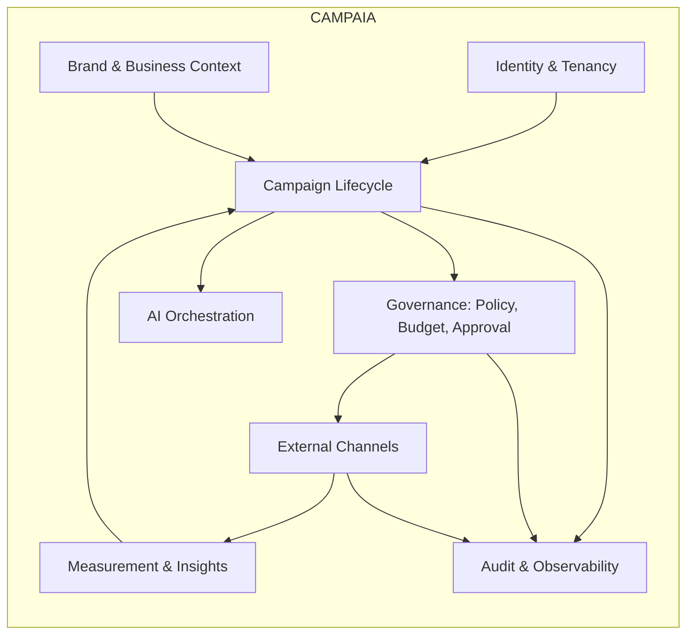

# CAMPAIA — PLANO MESTRE DE IMPLEMENTAÇÃO

**Versão:** 0.1 (PROPOSTA — não aprovada)
**Data:** 25/08/2026
**Base normativa:** Ordem Mestra de Execução + skill `marketing-ai-system-design` + Arquitetura Mestra V2

> Este documento planeja. Não autoriza implementação estrutural, produção, campanhas reais nem movimentação
> de orçamento publicitário.

---

## 1. Enquadramento

| Dimensão | Definição |
|---|---|
| **Produto** | CAMPAIA — app mobile SaaS multiempresa e multimodelo para planejar, criar, aprovar, publicar, acompanhar e otimizar campanhas |
| **Canais** | Google Ads; Meta Ads (Facebook e Instagram); WhatsApp Business |
| **Usuário** | Dono ou responsável de marketing de pequena/média empresa, **sem conhecimento técnico** |
| **Autonomia padrão** | **Nível 1 — Aprovado** (fixado pela Ordem Mestra §6; não é decisão aberta) |
| **Autoridade final** | Fábio Aluizio da Silva |
| **Independência** | Produto autônomo; Kordena não é dependência (ADR-0002) |
| **Ordem de canais** | Google → Meta → conjunto → WhatsApp (ADR-0007) |
| **Segmento inicial** | **EM ABERTO** (D-03) |
| **Objetivo primário do MVP** | **EM ABERTO** (D-05) |
| **Modelo comercial de IA** | **EM ABERTO** (D-06) |

### 1.1 Hipóteses de dimensionamento (hipóteses, não fatos)

Declaradas para orientar escolhas de capacidade. **Não são metas comerciais e não foram validadas.**

| Hipótese | Valor assumido | Consequência de projeto |
|---|---|---|
| Tenants no primeiro ano | 50–500 | Monólito modular + Postgres único suportam com folga |
| Campanhas ativas por tenant | 1–20 | Volume de mutações externas baixo |
| Chamadas de IA por campanha criada | 8–25 | Custo por campanha precisa de teto explícito |
| Ingestão de métricas | 1 sync/hora por conta externa | Cabe em workers agendados; não exige streaming |
| Webhooks (Meta/WhatsApp) | dezenas a centenas/dia por tenant no início | Fila gerenciada suficiente; Kafka não se justifica no MVP |
| Retenção de `insight_snapshots` | 13 meses | Postgres inicialmente; ClickHouse apenas se romper |

Cada hipótese deve ser substituída por medição real antes da Fase 9.

---

## 2. Bounded contexts



| Contexto | Fonte canônica de | Nunca é dono de |
|---|---|---|
| Identity & Tenancy | tenants, unidades, usuários, papéis, permissões | dados de campanha |
| Brand & Business Context | Brand Kit, produtos, ofertas, metas, perfis de público | estado externo |
| Campaign Lifecycle | briefing, campanha, versões, plano por canal, estado | decisão de política |
| Governance | políticas, limites financeiros, aprovações, autonomia, kill switch | criativos |
| AI Orchestration | prompts versionados, execuções, custo, proveniência | credenciais de anúncios |
| External Channels | conexões, capacidades, recursos externos, reconciliação | regra de negócio |
| Measurement & Insights | snapshots, conversões, atribuição | mutação externa |
| Audit & Observability | trilha imutável, decisões de política, incidentes | qualquer estado mutável |

---

## 3. Máquina de estados da campanha

```
DRAFT → STRATEGY_READY → ASSETS_READY → VALIDATED → AWAITING_APPROVAL → APPROVED
      → PUBLISHING → ACTIVE → OPTIMIZING → PAUSED | COMPLETED | FAILED
```

Regras invariantes:

- transição para `PUBLISHING` exige decisão `APROVADO` registrada do Policy/Approval Engine com ator humano
  identificado (autonomia Nível 1);
- `ACTIVE` só é declarado com **ID externo reconciliado** por canal; publicação parcial mantém a campanha em
  `PUBLISHING` com Saga aberta;
- `FAILED` nunca apaga recurso externo silenciosamente; compensação é decisão de política registrada;
- `PAUSED` é alcançável por kill switch em qualquer estado a partir de `APPROVED`.

Implementado e testado em `backend/campaia_core/states.py`.

---

## 4. Invariantes arquiteturais (checklist obrigatório por bloco)

| # | Invariante | Verificação |
|---|---|---|
| I-01 | App mobile é cliente não confiável | Nenhum segredo no bundle; toda regra crítica no backend |
| I-02 | IA propõe, serviço determinístico executa | Nenhum caminho de código permite ao gateway de IA chamar conector |
| I-03 | IA nunca recebe token de Google/Meta/WhatsApp | Sanitizador + `SecretRef` redigido + teste |
| I-04 | `tenant_id` em toda camada | RLS + filtro de aplicação + teste de isolamento |
| I-05 | Orçamento, políticas e autorização fora dos prompts | Motor determinístico independente do LLM |
| I-06 | Toda mutação externa é idempotente e reconciliada | Idempotency key + ID externo + job de reconciliação |
| I-07 | Auditoria de quem propôs, aprovou, executou, alterou, pausou | Trilha append-only |
| I-08 | Capacidade honesta por conta/país/versão | Capability Registry versionado |
| I-09 | Aprovação humana por padrão para risco relevante | Lista fechada de gatilhos, testada |
| I-10 | Consentimento e opt-out do WhatsApp preservados | Base legal e opt-out auditáveis |
| I-11 | Sem vazamento entre tenants em cache, embeddings e aprendizado | Chave com tenant; teste dedicado |
| I-12 | Nunca declarar publicação sem confirmação externa | Estado derivado do provedor, não da intenção |

---

## 5. Estratégia de testes

| Camada | Tipo | Bloqueia gate |
|---|---|---|
| Domínio | Unitário (máquina de estados, políticas, orçamento) | G1, G6 |
| Persistência | Migrations up/down, RLS, isolamento multi-tenant | G2 |
| Autorização | RBAC/ABAC por papel, tenant e valor | G2 |
| IA | Validação de schema, evals por tarefa, teto de custo, fallback registrado | G3 |
| Conectores | Contrato + fixtures, idempotência, retry, circuit breaker, webhook, dedupe, reconciliação | G4 |
| Sandbox | Criação e reconciliação em contas de teste | G4 |
| Mobile | Android + iOS, estados de tela, acessibilidade, duplo envio | G5 |
| Financeiro | Limites, bloqueio, kill switch, impossibilidade de gasto não autorizado | G6 |
| E2E | briefing → aprovação → publicação → métricas → pausa | G7 |
| Segurança | SAST, dependências, autorização, isolamento | G2, G7 |
| Carga e recuperação | Filas, Sagas incompletas, falha de provedor, restore | G7 |

Regras da Ordem Mestra, item 14, aplicadas literalmente: mock não comprova integração; sandbox não comprova
produção; código existente não comprova funcionalidade; teste iniciado não é teste aprovado.

---

## 6. Roadmap por gates

| Gate | Nome | Evidência exigida |
|---|---|---|
| G1 | Arquitetural | Requisitos, contratos, ADRs críticas aprovadas, riscos registrados |
| G2 | Segurança | Multi-tenancy, RBAC/ABAC, OAuth, cofre, threat model, auditoria testados |
| G3 | IA | Schemas, evals, custo, fallback, proveniência, sanitização |
| G4 | Integração | Contratos, fixtures, sandbox, webhooks, idempotência, reconciliação |
| G5 | Mobile | Android, iOS, acessibilidade, estados, fluxo ponta a ponta |
| G6 | Financeiro | Limites, aprovação, alertas, bloqueio, kill switch comprovados |
| G7 | Final | Build, testes, E2E, CI, segurança, documentação coerente, sem regressão crítica |
| — | Produção | **Autorização expressa e específica do Diretor** |

Nenhuma fase avança porque o código foi escrito. Avança porque a evidência do gate existe.

---

## 7. Ordem de execução

**Justificativa da ordem:** o motor determinístico (governança, orçamento, aprovação) precisa existir e ser
testável **antes** da IA e **antes** dos conectores. Assim, o pior defeito possível da IA é um rascunho ruim,
nunca um gasto não autorizado.

1. Núcleo determinístico — **feito**, 64 testes.
2. Provider Simulator e Saga multicanal — **feito**.
3. Permissões RBAC/ABAC, webhooks/outbox, AI Gateway com provedor simulado (Bloco B).
4. Fundação com banco, auth e CI (Bloco C, exige PC).
5. Adaptadores reais na ordem de ADR-0007, cada um até o Gate de Integração com sandbox.
6. Aplicativo mobile sobre contratos já estáveis.
7. Validação com as contas do Diretor.
8. Comercialização, após autorização expressa.

Ver `10_PLANO_AQUI_VS_PC.md` para a divisão operacional detalhada.
