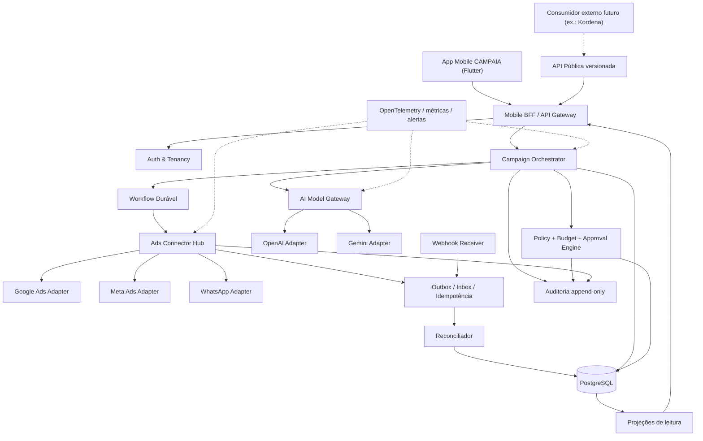

# CAMPAIA — ARQUITETURA MESTRA V2

**Substitui:** `ARQUITETURA_KORDENA_MARKETING_AI_V1-1.md` (V1.1 passa a `SUBSTITUÍDA`)
**Status:** PROPOSTA — sujeita ao Gate Arquitetural (G1)
**Data:** 25/08/2026 · **Diretor:** Fábio Aluizio da Silva

## Mudanças em relação à V1.1

| # | Mudança | Origem |
|---|---|---|
| 1 | Produto renomeado para **CAMPAIA** | Decisão do Diretor (ADR-0001) |
| 2 | Deixa de ser bounded context conectado ao Core do Kordena; passa a produto autônomo com **integração futura opcional via API pública** | Decisão D-02 (ADR-0002) |
| 3 | Identidade, tenancy, auditoria e infraestrutura **próprias** | Consequência de 2 |
| 4 | Ordem de canais fixada: **Google Ads → Meta → operação conjunta → WhatsApp** | Decisão D-04 (ADR-0007) |
| 5 | Autonomia padrão **Nível 1** declarada invariante, não configuração inicial | Ordem Mestra §6 |
| 6 | Acrescentado tratamento explícito dos níveis de acesso reais de cada plataforma | Capability Matrix v0.2 |

---

## 1. Posição arquitetural

CAMPAIA é um produto independente. O Kordena não é dependência de execução, de dados, de identidade nem de
release.

**Integração futura (D-02, opção C):** o Kordena — ou qualquer outro sistema — poderá se tornar
**consumidor externo** da API pública da CAMPAIA. Regras dessa porta:

- integração acontece por API pública versionada e webhooks, nunca por banco, schema ou biblioteca compartilhada;
- CAMPAIA não conhece entidades do Kordena; um consumidor externo é apenas um `tenant` com credencial de API;
- nenhum requisito do Kordena entra no roadmap da CAMPAIA sem ADR própria;
- a integração exige decisão expressa do Diretor no momento em que for proposta.

**Teste arquitetural obrigatório:** nenhum módulo da CAMPAIA pode importar, referenciar ou assumir a
existência de artefatos do Kordena. Violação quebra o build.

---

## 2. Componentes



Forma inicial: **monólito modular + workers + workflow durável** (ADR-0003). Fronteira de módulo = bounded
context. Comunicação entre contextos só por contrato — import cruzado é proibido e verificado por lint
arquitetural.

---

## 3. Caminho crítico da governança

O invariante que define o produto:

```
IA  →  proposta estruturada  →  validação determinística  →  política  →  orçamento
    →  autonomia  →  aprovação humana  →  conector oficial  →  confirmação externa
    →  reconciliação  →  auditoria
```

Nenhum atalho é permitido. Em particular:

- o AI Model Gateway **não tem** referência ao Ads Connector Hub em tempo de compilação;
- o Ads Connector Hub só aceita comandos que carreguem um `policy_decision_id` válido e não expirado;
- `policy_decision_id` só é emitido pelo Policy Engine, que é determinístico e não consulta LLM;
- toda mutação externa exige `idempotency_key` derivada de `(tenant_id, command_id)`.

---

## 4. Ordem de canais e o que ela implica

Sequência aprovada (D-04): **1) Google Ads → 2) Meta (Facebook + Instagram) → 3) operação conjunta →
4) WhatsApp.**

| Etapa | Ganho | Dependência externa crítica |
|---|---|---|
| 1. Google Ads | Um único adaptador, conta de teste disponível desde o início, mensuração por conversão bem definida | Developer token; nível de acesso do token limita produção |
| 2. Meta | Facebook e Instagram no mesmo adaptador; abre a porta do WhatsApp | Business Verification; App Review para operar contas de terceiros |
| 3. Operação conjunta | Saga multicanal real; comparação de canal; alocação de verba entre plataformas | Etapas 1 e 2 em produção |
| 4. WhatsApp | Click-to-WhatsApp e mensagens permitidas | WABA, verificação de negócio, templates aprovados, consentimento |

**Consequência de projeto:** a Saga multicanal e a alocação de verba entre plataformas são desenhadas desde a
etapa 1, mas só exercitadas de verdade na etapa 3. O adaptador do Google não pode assumir que é o único.

**Fato relevante:** Click-to-WhatsApp é criado pelo fluxo de anúncios da Meta. WhatsApp na etapa 4 depende da
etapa 2 estar concluída — não é um canal isolável.

---

## 5. Modelo de tenancy

```
tenant (empresa cliente)
 └── business_unit (opcional: filial, loja, marca)
      └── external_account (conta de anúncios conectada, por provedor)
```

- `tenant_id` é obrigatório em toda tabela de negócio e em toda chave de cache;
- isolamento em duas camadas: RLS no PostgreSQL **e** filtro na aplicação (defesa em profundidade);
- credencial de provedor pertence a `external_account`, nunca ao usuário;
- saldo/limite de IA é por `tenant`, nunca global;
- embeddings, cache de prompt e aprendizado são particionados por `tenant_id`.

---

## 6. Stack (proposta, sujeita a D-08)

| Camada | Escolha | Observação |
|---|---|---|
| Mobile | Flutter + Dart | Base única Android/iOS |
| Backend | Python + FastAPI, monólito modular | Versão exata pendente (P-05) |
| Contratos | JSON Schema + OpenAPI 3.1 + AsyncAPI | Já iniciados em `contracts/` |
| Banco | PostgreSQL com RLS | — |
| Cache/locks | Redis | Chave sempre prefixada por tenant |
| Workflow durável | A decidir (ADR-0010) | Temporal é a referência da V1.1 |
| Eventos | Fila gerenciada no MVP | Kafka só se a escala provar necessidade |
| Objetos | Storage compatível com S3 | Criativos e assets |
| Observabilidade | OpenTelemetry + métricas + logs sanitizados | — |
| Segredos | Cofre gerenciado + KMS | ADR-0006 |

---

## 7. O que a V2 explicitamente **não** decide

- nuvem, região e orçamento de infraestrutura (D-08);
- modelo comercial de IA (D-06);
- segmento inicial (D-03) e objetivo primário do MVP (D-05);
- base legal e política de retenção LGPD (D-09).

Cada um desses itens abre ADR própria quando decidido.
