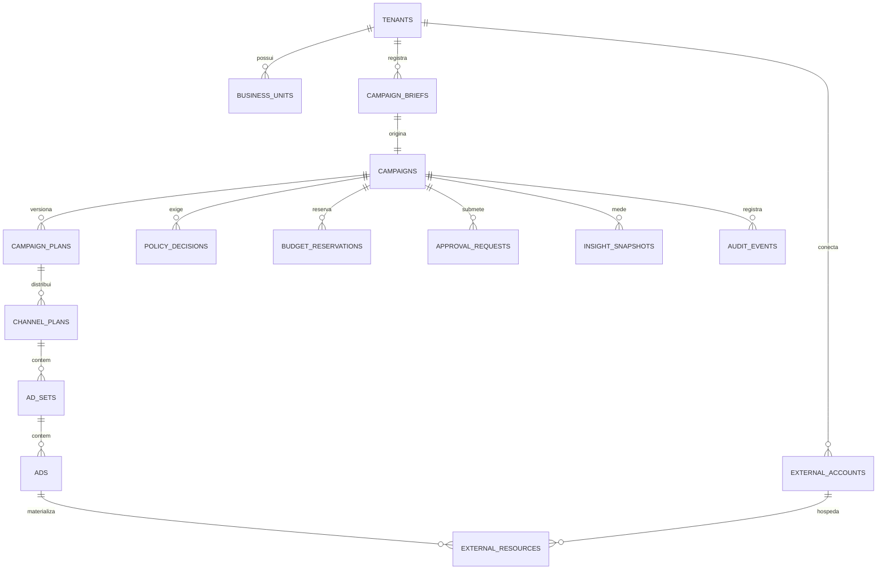

# CAMPAIA — MODELO LÓGICO DE DADOS

**Versão:** 0.1 (PROPOSTA) · **Banco:** PostgreSQL com RLS · **Data:** 25/08/2026

## 1. Regras transversais

| Regra | Aplicação |
|---|---|
| `tenant_id` obrigatório | Toda tabela de negócio. RLS + filtro na aplicação (defesa em profundidade) |
| Sem `DELETE` físico em dado crítico | `deleted_at` governado; auditoria e finanças são append-only |
| Versionamento | `campaigns`, `campaign_plans`, `prompts`, `policies` versionam em vez de sobrescrever |
| Referência externa | `provider`, `external_account_id`, `external_resource_id`, `api_version`, `sync_status`, `last_synced_at` |
| Idempotência | Toda mutação externa grava `idempotency_key` única por `(tenant_id, command_id)` |
| Moeda | Sempre `numeric` + código ISO. Nunca ponto flutuante em valor financeiro |
| Tempo | `timestamptz` sempre; fuso do tenant é apresentação, não armazenamento |

## 2. Agrupamentos

### Identidade e tenancy
`tenants` · `business_units` · `users` · `memberships` · `roles` · `permissions` · `api_clients`

`api_clients` é o que permite um consumidor externo futuro (ex.: Kordena) sem qualquer acoplamento interno.

### Contexto de negócio
`brand_profiles` · `products` · `offers` · `business_goals` · `audience_profiles` · `brand_restrictions`

`brand_restrictions` alimenta o Policy Engine determinístico — **não** é apenas texto de prompt.

### Campanha
`campaign_briefs` · `campaigns` · `campaign_versions` · `campaign_plans` · `channel_plans` · `ad_sets` ·
`ads` · `copy_variants` · `creative_assets`

`campaigns.state` implementa a máquina de estados; transição inválida é rejeitada no banco por constraint,
não só no código.

### Governança e finanças
`approval_policies` · `approval_requests` · `approval_decisions` · `policy_decisions` · `budgets` ·
`budget_reservations` · `spend_limits` · `spend_ledger` · `kill_switches` · `autonomy_settings`

`policy_decisions.id` é o `policy_decision_id` exigido por toda mutação externa. Tem `expires_at`: decisão
velha não autoriza publicação nova.

`budget_reservations` reserva verba **antes** da publicação e libera na confirmação ou na compensação. Sem
reserva, duas publicações concorrentes podem estourar o limite.

### IA
`provider_configs` · `model_policies` · `prompt_versions` · `ai_runs` · `ai_cost_ledger` · `ai_evals`

`ai_runs` guarda proveniência completa, inclusive provedores tentados e fallback. `ai_cost_ledger` é por
tenant e é a base de qualquer modelo comercial de IA (D-06).

### Conexões externas
`ad_connections` · `external_accounts` · `oauth_grants` · `connector_capabilities` · `capability_evidence`

`oauth_grants` guarda **referência** ao segredo no cofre, nunca o segredo. `capability_evidence` guarda URL e
data da fonte oficial que comprova cada capacidade.

### Mensuração
`insight_snapshots` · `conversion_events` · `attribution_records` · `whatsapp_consents` · `whatsapp_templates`

`whatsapp_consents` registra base legal, origem, data e opt-out por contato. Sem registro, não há envio.

### Infraestrutura de consistência
`workflow_instances` · `outbox_events` · `inbox_events` · `webhook_receipts` · `idempotency_keys` ·
`reconciliation_runs` · `divergences`

### Auditoria
`audit_events` (append-only) · `incidents`

`audit_events` responde sempre: quem propôs, quem aprovou, quem executou, o que mudou, quando, com qual
versão e qual evidência externa.

## 3. Relação central (simplificada)

## 4. Pontos que exigem cuidado na implementação

1. **Concorrência de orçamento:** reserva com bloqueio otimista + constraint que impede soma de reservas
   ativas acima do limite. Testável sem plataforma externa.
2. **Transição de estado:** `check` constraint ou tabela de transições válidas. Um `UPDATE` direto não pode
   colocar campanha em `ACTIVE`.
3. **RLS não substitui autorização:** RLS protege contra falha de query; autorização protege contra falha de
   regra. As duas são obrigatórias.
4. **Retenção:** `insight_snapshots` e `ai_runs` crescem rápido. Política de retenção definida antes da
   Fase 9, não depois de o banco doer.
5. **Cache:** toda chave Redis prefixada com `tenant_id`. Teste automatizado que falha se aparecer chave sem
   prefixo.
