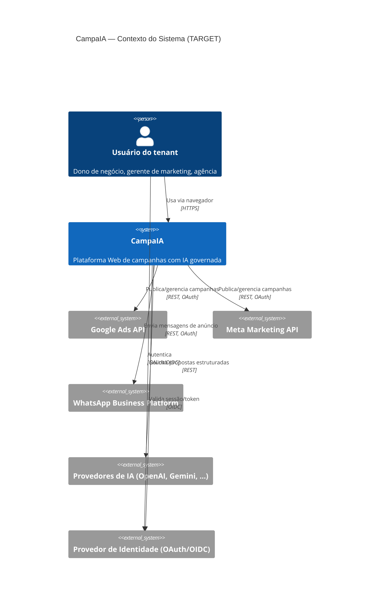
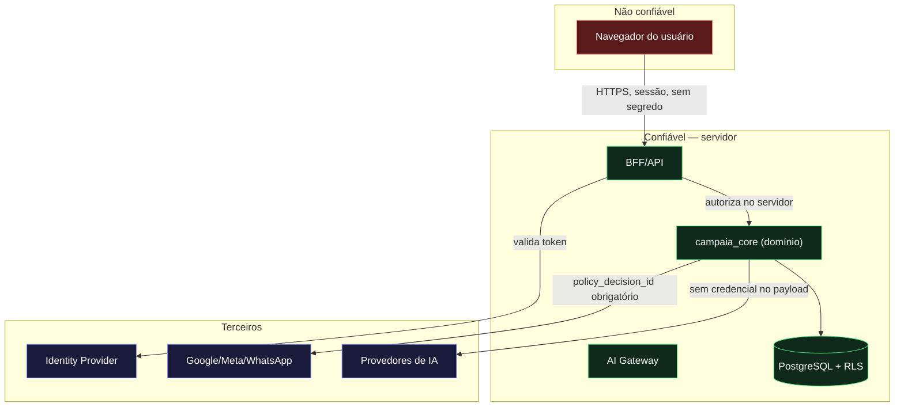
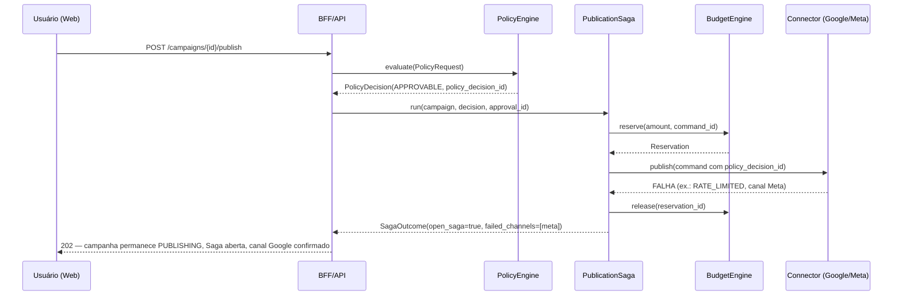
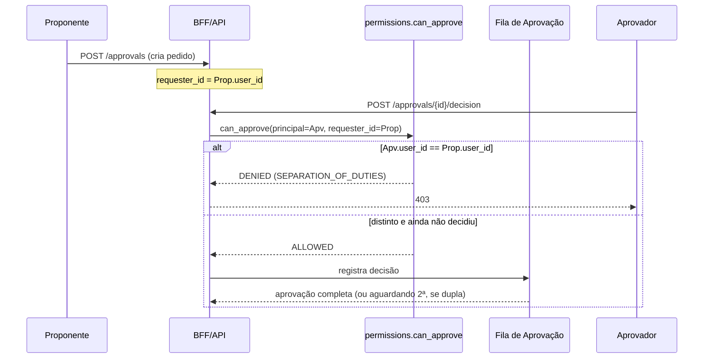
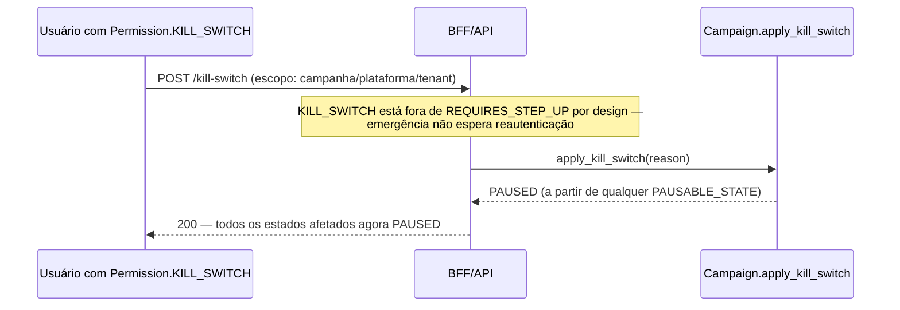
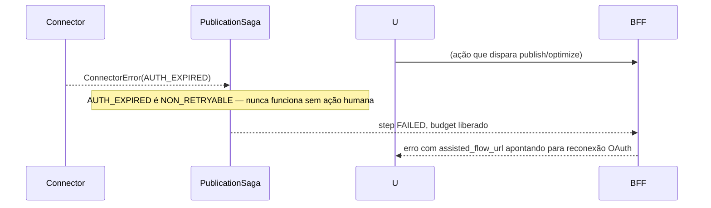

# CampaIA — Ponto Zero Web · 03. Arquitetura Web, Domínio, Dados, Autenticação e Fluxos

**Status:** TARGET com decisões arquiteturais APROVADAS (ADR-0016–0019, 19/09/2026) — **WP-01 implementado e validado** (ver `docs/web/08_CERTIFICACAO_WP01_FUNDACAO_WEB.md`); WP-02 em diante ainda não iniciados.

---

## 1. Bounded contexts e autoridades canônicas

| Contexto | Responsabilidade | Fonte de verdade | Módulo/tabela CURRENT | Dependências permitidas | Dependências proibidas |
|---|---|---|---|---|---|
| Identity & Access | Autenticação, sessão, MFA, step-up | Provider de identidade (TARGET) + `permissions.py` | `campaia_core/permissions.py` (autoridade de autorização já existe) | Tenant & BU | Nenhuma autoridade de domínio de negócio |
| Tenant & Business Unit | Isolamento multi-tenant | `tenant_id`/`business_unit_id` | RLS no DDL, `Principal`/`Resource` | — | — |
| Customer/Product/Offer | Catálogo do cliente do CampaIA | TARGET, não modelado ainda | — | Tenant | — |
| Brand Kit | Identidade visual/voz da marca do cliente | `brand_profiles` (tabela) | `api/routes_brand.py` | Tenant | Campaign Execution |
| Campaign Planning | Briefing, estratégia, plano versionado | `campaigns` (JSONB brief/plan) | `api/routes_campaigns.py` (`create_brief`, `get_plan`, `regenerate_plan`) | AI Orchestration, Brand Kit | Provider Connections diretamente |
| Creative Assets | Geração/gestão de criativos | AI Gateway (`GENERATE_IMAGE`/`GENERATE_COPY`) | parcialmente em `ai_gateway.py` | AI Orchestration | Campaign Execution |
| AI Orchestration | Propostas estruturadas, nunca execução | `ai_gateway.py`, `agents.py` | **leitura integral confirmada** — agentes recusam contexto obrigatório ausente (`agents.py`), gateway rejeita schema inválido e debita custo sempre que a chamada chega ao provedor (`ai_gateway.py`) | — | Provider Connections, Budget, Approval (nunca decide sozinho) |
| Approval & Autonomy | Fila de aprovação, segregação de funções, níveis de autonomia | `permissions.py` (`can_approve`), `autonomy.py` | **autoridade canônica já implementada e testada** | Identity & Access | — |
| Budget & Policy | Reserva/gasto, Policy Engine | `budget.py`, `policy.py` | **autoridade canônica já implementada e testada** | Approval & Autonomy | AI Orchestration (IA nunca decide política sozinha) |
| Campaign Execution | Máquina de estados, Saga de publicação | `states.py`, `saga.py` | **autoridade canônica já implementada e testada** | Budget & Policy, Provider Connections | — |
| Provider Connections | Adaptadores Google/Meta/WhatsApp | `connectors.py` (contrato only) | `Protocol AdsConnector`, nenhum adaptador real ainda | Campaign Execution (via Saga) | AI Orchestration diretamente |
| Insights & Conversions | Métricas, conversões | `GET /campaigns/{id}/insights` — placeholder honesto | parcial, sem dado real | Provider Connections | — |
| Optimization | Sugestões de pacing/otimização | `pacing.py`, `optimizer.py` | implementado (não lido linha a linha) | AI Orchestration, Approval & Autonomy | Execução direta (nunca autoexecuta) |
| Notification | Avisos ao usuário | inexistente | — | — | — |
| Audit & Compliance | Trilha imutável | `audit_events` (tabela), `GET /audit-events` | parcial | Todos os contextos (write-only) | — |
| Billing futuro | Receita própria do CampaIA | **inexistente** | — | — | Campaign Execution, Budget (orçamento de campanha NÃO é receita) |
| Fiscal Handoff | Emissão fiscal de billing próprio | `fiscal_handoff.py` — fail-closed, bloqueado | **implementado e bloqueado deliberadamente** | Billing futuro (quando existir) | Campaign Execution, Budget |

### Invariantes preservados obrigatoriamente (Documento Mestre + código já existente)

- Orçamento de campanha **não é** receita do CampaIA (confirmado: `fiscal_handoff.py` deliberadamente desconectado de `budget.py`/`saga.py`).
- Gasto de mídia **não é** billing do CampaIA.
- `fiscal_handoff.py` permanece fail-closed — nenhum Work Package desta fase o conecta a nada.
- IA não possui autoridade de execução crítica (`ai_gateway.py` não importa `connectors`/`saga`, confirmado por teste arquitetural citado no próprio código).
- Frontend não possui autoridade financeira — toda validação de orçamento/política ocorre em `budget.py`/`policy.py` no servidor.
- Conectores não recebem decisões diretamente de modelos — só `command`s com `policy_decision_id` emitido pelo `PolicyEngine` (`require_authorization()` em `connectors.py` recusa qualquer mutação sem ele).
- Toda mutação externa exige idempotência e reconciliação — já implementado (`idempotency_key` obrigatório, `IdempotencyStore`).

---

## 2. Diagramas de arquitetura (Mermaid)

### 2.1 Contexto do sistema



### 2.2 Containers

```mermaid
C4Container
  title CampaIA — Containers (TARGET)
  Person(usuario, "Usuário")
  Container(web, "Frontend Web", "framework a decidir (ADR-0017)", "SPA/SSR autenticado, apresenta e coleta comandos")
  Container(bff, "BFF/API", "Python (Starlette, preservado)", "21+ rotas HTTP, autenticação de sessão, autorização")
  Container(core, "campaia_core", "Python puro", "Domínio: estados, autonomia, policy, budget, saga, permissions — PRESERVADO INTEGRALMENTE")
  Container(db, "PostgreSQL", "Postgres 16", "Fonte de verdade persistente, RLS por tenant — schema já verificado")
  Container(connectors, "Provider Connections", "adaptadores (TARGET)", "Google Ads, Meta, WhatsApp — hoje só contrato/simulador")
  Container(aigw, "AI Gateway", "Python puro — PRESERVADO", "Propostas estruturadas, sem autoridade de execução")
  Container(mobile, "App Mobile (Flutter)", "QUARENTENA", "Preservado, sem evolução")

  Rel(usuario, web, "HTTPS")
  Rel(web, bff, "REST/JSON", "sessão autenticada")
  Rel(bff, core, "chamadas de processo (in-process)")
  Rel(bff, db, "SQL", "via repositórios")
  Rel(core, connectors, "comandos autorizados por policy_decision_id")
  Rel(core, aigw, "solicita proposta estruturada")
  Rel(connectors, "Google/Meta/WhatsApp", "REST, OAuth")
```

### 2.3 Trust boundaries



**Regra explícita**: o navegador nunca cruza para dentro do boundary confiável. Nenhum segredo, `SecretRef`, `policy_decision_id` bruto de terceiros ou credencial de provider atravessa para o cliente — o frontend só recebe estado já processado e comandos já validados.

---

## 3. Estrutura Web (páginas/áreas)

| Área | Rota do backend consumida | Autoridade |
|---|---|---|
| Aplicação pública (marketing/login) | — | Nenhuma (não autenticado) |
| Autenticação | TARGET (ADR-0018) | Identity Provider |
| Onboarding | `POST /brand-profiles`, `POST /connections/oauth/start` | Tenant & BU |
| Painel principal (dashboard) | `GET /campaigns`, `GET /audit-events` | Campaign Execution |
| Gestão de campanhas | `GET/POST /campaigns*` | Campaign Planning/Execution |
| Editor/assistente de campanha (briefing → estratégia → criativos → prévia) | `POST /briefs`, `GET/POST /campaigns/{id}/plan*`, `POST .../validate` | Campaign Planning, AI Orchestration |
| Brand Kit | `GET/POST /brand-profiles` | Brand Kit |
| Biblioteca de assets | TARGET (rota nova) | Creative Assets |
| Aprovações | `GET/POST /approvals*` | Approval & Autonomy |
| Conexões | `GET/POST/DELETE /connections*` | Provider Connections |
| Métricas | `GET /campaigns/{id}/insights` | Insights & Conversions (hoje placeholder) |
| Orçamento | `PATCH /campaigns/{id}/budget` | Budget & Policy |
| Recomendações | TARGET (expor `pacing`/`optimizer`) | Optimization |
| Configurações (autonomia) | `GET/PUT /autonomy` | Approval & Autonomy |
| Usuários e permissões | TARGET (rota nova) | Identity & Access |
| Auditoria | `GET /audit-events` | Audit & Compliance |
| Central de notificações | TARGET (rota nova) | Notification |

Estados obrigatórios em toda área relevante: loading, vazio, sucesso, parcial, erro, indisponível, não autorizado, confirmação crítica — exigido por `CLAUDE.md` (Engenharia) e `02-PADROES-DE-CONSTRUCAO-NOVA-FM.md` §14.

### Regra de autoridade do frontend (obrigatória)
O frontend Web: apresenta, coleta entradas, solicita comandos, acompanha estado, exibe evidência. **Nunca**: decide autorização crítica sozinho, guarda segredo, chama Google/Meta/WhatsApp diretamente, aplica política financeira, trata resposta otimista como confirmação externa — todas essas proibições já são impostas hoje pelo próprio domínio (`connectors.py` exige `policy_decision_id`; `budget.py` só confirma gasto após `actual_spend` real).

---

## 4. Fluxos críticos (amostra representativa — não os 30 integralmente, priorizados por risco)

### 4.1 Publicação multicanal com falha parcial



Este fluxo já é real no código (`saga.py::_publish_channel`, `_finish`) — o diagrama documenta comportamento existente, não uma proposta nova.

### 4.2 Aprovação com segregação de funções



Comportamento real já testado (`permissions.py::can_approve`, `dual_approval_complete`).

### 4.3 Kill switch (emergência, sem step-up)



### 4.4 Expiração/revogação OAuth de conta externa



Comportamento já modelado em `connectors.py` (`NON_RETRYABLE`, `assisted_flow_url`).

`PENDÊNCIA`: os demais 26 fluxos do Bloco 14 do prompt mestre (criação de conta, convite de usuário, geração de estratégia/copy/asset, otimização automática limitada, indisponibilidade de modelo de IA, incidente de segurança, etc.) não têm diagrama de sequência produzido nesta rodada — a maioria depende de peças ainda inexistentes (autenticação real, adaptadores reais) e será detalhada no Work Package correspondente, não inventada aqui sem essas dependências resolvidas.

---

## 5. Estados e workflows

`FATO CONFIRMADO`: a máquina de estados canônica **já existe e já é exatamente** a proposta pelo Bloco 15 do prompt mestre:

```
DRAFT → STRATEGY_READY → ASSETS_READY → VALIDATED → AWAITING_APPROVAL → APPROVED → PUBLISHING → ACTIVE → OPTIMIZING → PAUSED / COMPLETED / FAILED
```

Confirmado literalmente em `campaia_core/states.py::CampaignState` e `TRANSITIONS`. **Não presumir que está implementada integralmente em todas as camadas** — a máquina de estados de domínio está completa e testada; a exposição Web (UI que reflita cada estado com as ações válidas) é TARGET.

| Estado | Autoridade | Pré-condição | Comandos válidos | Guarda real (código) |
|---|---|---|---|---|
| DRAFT | Campaign Planning | — | avançar a STRATEGY_READY ou FAILED | nenhuma |
| STRATEGY_READY → ASSETS_READY | Campaign Planning | — | avançar, voltar a DRAFT | nenhuma |
| ASSETS_READY → VALIDATED | Campaign Planning | validação de política prévia | avançar, voltar, falhar | nenhuma no grafo (validação ocorre via `POST /validate`, fora da transição) |
| VALIDATED → AWAITING_APPROVAL | Approval & Autonomy | — | avançar, voltar, falhar | nenhuma |
| AWAITING_APPROVAL → APPROVED | Approval & Autonomy | aprovação humana registrada | avançar, voltar, falhar | nenhuma na transição em si (a aprovação é registrada fora) |
| APPROVED → PUBLISHING | Budget & Policy + Approval | `policy_decision_valid=True` **e** `human_approval_id` presente | `_guard_publishing` | `GuardFailed` se kill switch ativo, política inválida ou sem aprovação |
| PUBLISHING → ACTIVE | Provider Connections | **todos** os canais planejados com `external_resource_id` CONFIRMED | `_guard_active` | `GuardFailed` com `missing_channels` se publicação parcial — campanha fica presa em PUBLISHING |
| PAUSED → ACTIVE | Approval & Autonomy | kill switch inativo | `_guard_resume` | `GuardFailed` se kill switch ativo |
| Qualquer PAUSABLE_STATE → PAUSED | Kill switch (emergência) | nenhuma (único caminho sem fila normal) | `apply_kill_switch` | nenhuma — deliberadamente sem guarda, só reduz efeito |

Saga (`saga.py`) já implementa: `PAUSE_ALL` / `KEEP_PARTIAL` / `ESCALATE_HUMAN` como políticas de compensação configuráveis por tenant; outbox/inbox e reconciliação existem por nome de módulo (não lidos linha a linha nesta missão — `PENDÊNCIA` de leitura completa antes de qualquer Work Package que os altere). CQRS e Event Sourcing **não são necessários agora** — o domínio já opera por comando direto + eventos de notificação (AsyncAPI), sem necessidade demonstrada de projeções separadas.

---

## 6. Modelo de dados

`FATO CONFIRMADO`: 7 tabelas já existem e foram verificadas contra Postgres 16 real nesta mesma sessão: `brand_profiles`, `connections`, `campaigns`, `approvals`, `audit_events`, `idempotency`, `tenant_autonomy`. Todas com `tenant_id` obrigatório e RLS.

### 6.1 Plano de evolução de schema (TARGET, não executado)

| Entidade | Status | Ação proposta | Observação |
|---|---|---|---|
| `brand_profiles`, `connections`, `campaigns`, `approvals`, `audit_events`, `idempotency`, `tenant_autonomy` | Existente, verificado | **Preservar sem alteração estrutural** | Já cobre o que está de fato persistido em `api/db.py` |
| `users` / `identity` | Inexistente | **Criar** | TARGET da autenticação real (ADR-0018) |
| `business_units` | Parcialmente coberta (`business_unit_id` já é coluna nullable em RLS/domínio) | **Avaliar tabela própria** quando D-03 (single-tenant vs. agência multi-empresa) for decidida — decisão ainda aberta, não antecipar | Confirmado: `permissions.py` já documenta que a extensão deve ser aditiva |
| `budget_reservations` | Hoje em memória (`BudgetEngine._reservations`) | **Não criar tabela nesta fase** sem necessidade comprovada de auditoria de reservas — mesma disciplina já aplicada ao B7 original (não persistir o que não tem precedente real) | Decisão a levar ao Diretor se auditoria de reservas virar requisito |
| `outbox` / `inbox` | Módulo existe (`outbox.py`), persistência não confirmada nesta leitura | **Verificar antes de assumir** — `PENDÊNCIA`, exige leitura completa do módulo | — |
| `insights` / `conversions` | Inexistente | **Criar** quando adaptadores reais existirem — não antes, para não modelar dado especulativo | Mesma disciplina do B7 original |
| `notifications` | Inexistente | **Criar** como parte do Work Package de Notification | — |
| `fiscal_billing_facts` | Inexistente, deliberadamente | **Não criar** enquanto não houver autoridade real de billing próprio (bloqueio preservado) | `fiscal_handoff.py` continua fail-closed |

`REGRA`: nenhuma migration é executada nesta missão. O plano acima é declarativo, para orientar Work Packages futuros.

Cada entidade, quando criada, deve seguir o padrão já estabelecido no DDL existente: `tenant_id` obrigatório, RLS, `business_unit_id` nullable, timestamps, e nenhuma tabela nova sem consumidor real comprovado em código (mesma disciplina do B7 documentada no cabeçalho de `001_initial_schema.sql`).

---

## 7. Autenticação, Autorização e Tenancy

`FATO CONFIRMADO`: o **domínio de autorização já está completo e testado** — RBAC (6 papéis), ABAC (tenant, business unit, step-up de 10 minutos, MFA, teto de valor por papel), isolamento tenant-first com `NOT_FOUND` em vez de `PERMISSION_DENIED` (impede enumeração), segregação de funções em aprovação dupla.

**O que falta (TARGET)**: a camada de sessão Web que alimenta esse domínio com um `Principal` real, a partir de uma autenticação real.

### 7.1 Requisitos obrigatórios para a sessão Web (ADR-0018 detalha as opções)
- Cookies seguros (`HttpOnly`, `Secure`, `SameSite`), não `localStorage` para sessão.
- CSRF token em toda mutação.
- CORS restrito por ambiente.
- Expiração e rotação de sessão; logout invalida no servidor.
- Tenant ativo **nunca** determinado por header não confiável — deve vir de claim de sessão validada no servidor, cruzada contra os tenants aos quais o `user_id` pertence.
- Troca de tenant/unidade invalida elevação administrativa (`step_up_at`) — consistente com a janela de 10 minutos já codificada.
- MFA obrigatório para as mesmas permissões que `permissions.py` já marca em `REQUIRES_MFA` (`BUDGET_CHANGE`, `CONNECTION_MANAGE`, `MEMBER_MANAGE`, `AUTONOMY_CHANGE`).
- IDOR/BOLA: já mitigado no domínio pela ordem de checagem (`authorize()` checa tenant antes de tudo) — a camada Web deve preservar essa ordem, nunca pular para "encontrei o recurso" antes de confirmar tenant.

### 7.2 Mapeamento RBAC/ABAC existente (referência, não recriar)
6 papéis (`OWNER`, `ADMIN`, `FINANCE`, `APPROVER`, `MARKETER`, `VIEWER`), 14 permissões, teto de valor por papel (`OWNER` sem teto, `ADMIN` R$10k, `FINANCE` R$50k, `APPROVER` R$5k) — todos já em `permissions.py`. Nenhuma alteração proposta nesta missão.
